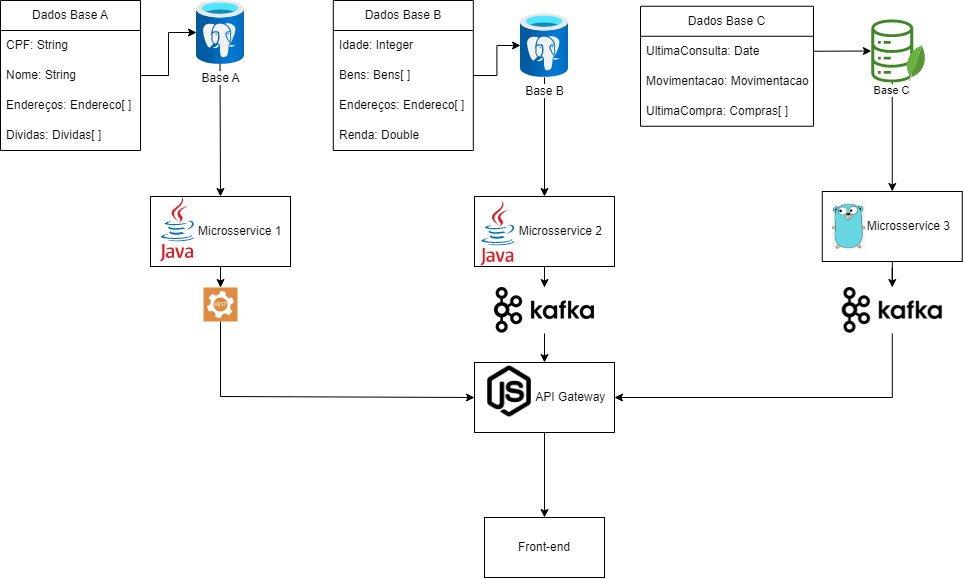

# desafio-serasa-monorepo
Desafio Serasa

## O Problema

**Segundo o desafio tinhas o seguinte problema:**
>**_NOTE:_** 
"Hoje, a Serasa Experian, como dito anteriormente, é o maior Bureau de crédito do Brasil.
Aqui trabalhamos constantemente com grande volume e complexidade de dados. Sabendo disso, precisamos que você elabore uma solução que ofereça armazenamento, processamento e disponibilização desses dados, sempre considerando que tudo deve estar conforme as boas práticas de segurança em TI. Afinal, nosso principal ativo são dados sensíveis dos consumidores brasileiros."

O problema supõem que existam 3 bases de dados externas. Base A, B e C.

**A Base "A"** é extremamente sensível e deve ser protegida com os maiores níveis de segurança, mas o acesso a esses dados não precisa ser tão performática.

**Tem os seguintes Dados:**

| Dados            |
|------------------|
| CPF              |
| Nome             |
| Endereço         |
| Lista de Dívidas |

---

A Base "B"que também possui dados críticos, mas ao contrário da Base A, o acesso precisa ser um pouco mais rápido.

**Tem os seguintes Dados:**

| Dados            |
|------------------|
| Idade            |
| Fonte de renda   |
| Endereço         |
| Lista de Bens    |

---

A Base "C", que não possui nenhum tipo de dado crítico, mas precisa de um acesso extremamente rápido.


**Tem os seguintes Dados:**

| Dados            |
|------------------|
| Última consulta do CPF em um Bureau de crédito (Serasa e outros).            |
| Movimentação financeira nesse CPF.   |
| Dados relacionados a última compra com cartao de crédito vinculado ao CPF    |

---

## Técnologias Utilizadas

<center>

| Linguagens | Bancos de dados | Transferência de Dados |
|:------------:|:-----------------:|:------------------------:|
|    |   |   |

</center>

<br>

##### Fluxograma da arquitetura de micro-serviços proposta:



## Proposta:

Criação de 3 microserviços que faram contato com as bases de dados externas, para o primeiro e segundo micro-serviço segurança é extremamente importante, os dados devem ser criptografados e devem estar protegidos de acessos externos, por isso, utilizei uma API Gateway que será quem fara contato das mesmas, para o primeiro escolhi a transferência de dados via API REST, já que não precisa ter uma grande velocidade da mesma forma recomendaria a utiliziação de um banco de dados PostgreSQL pela robustes e pelo formato dos dados.

Para o segundo microserviço, que exige criptografia dos dados, porém o mesmo precisa ser acessado rapidamente por isso utilizei transferencia de dados via kafka para uma maior velocidade, e também recomendaria a utiliziação de um banco de dados PostgreeSQL pelos mesmos motivos do primeiro micro-serviço.

Para o terceiro é necessário uma transferencia de dados muito rápida, para o rápido acesso a base de dados, escolhi um banco de documentos, neste caso MongoDB, e a transferência via kafka.

A Api Gateway acessa os dados e disponibiliza para quem precise acessar, descrito na imagem como exemplo um front-end.

### O que foi feito?
Por conta do tempo, não terminei totalmente os micro-serviços, para os serviços que precisavam de criptografia, acabei implementando uma criptografia e deixei eles sendo acessados sem a mesma. O terceiro micro-serviço proposto em golang também não foi concluído, sendo assim, fiz os microsserviços A e B, acessando dados mockados com suas respectivas transferências de dados (rest e kafka), em ambos os micro-serviços utilizei a arquitetura Hexagonal, pois me permitiria conectar qualquer tipo de banco de dados, ou até mesmo uma acesso remoto via api, kafka, etc com maior facilidade e me permitindo separar a transferência de dados da regra de négocio (application).

O docker-compose sobe as aplicações com o kafka e é possível acessar os dados via API do node, a disponibilização dos dados transferidos pelo kafka são logados na API Gateway, pois não encontrei uma maneira de transferir-las para o endpoint da API Gateway.

### Como Executar?
É necessário ter intalado o Docker.

Na pasta gateway fica a API-GATEWAY e precisa que criei um .env com o conteúdo do .env.example

Com o docker instalado, abrir um terminal e executar o comando:

```ubuntu
$ sudo docker compose up
```

Este comando começara a subir os containeres com as devidas conexões e export os endpoints localmente.


### API GATEWAY Endpoints

Os endpoints de acesso para "verificar" a funcionalidade são os seguintes:

Importante salientar que após a execução do docker compose up a porta de acesso para a API Gateway é 8085 (http://localhost:8085);

 - **/scores** - Vai mandar enviar uma chamada HTTP para o micro-service-b e assim enviar uma mensagem para o producer kafka que será consumido pela API-GATEWAY, é apenas apresentado no console.
 - **/user?id_user=id1** (header securityToken: validToken) - vai enviar uma requisição HTTP simples para o micro-service-a que respondera um usuário do banco de dados mockado.

Os outros dois micro-serviços também foram expostos, e são acessiveis pelos seguintes caminhos:

- **Micro-service-a** : http://localhost:8080
    - Endpoints: /users/info?id_user=id2 (header securityToken: validToken)
- **Micro-service-b** : http://localhost:8081
    - Endpoints: /send-score

## Agradecimentos

Gostaria de agradecer ao SerasaExperian pelo desafio apesar de não eu conseguir completar-lo por conta da dificuldade e do tempo, porém creio que consegui demonstrar algum conhecimento.

